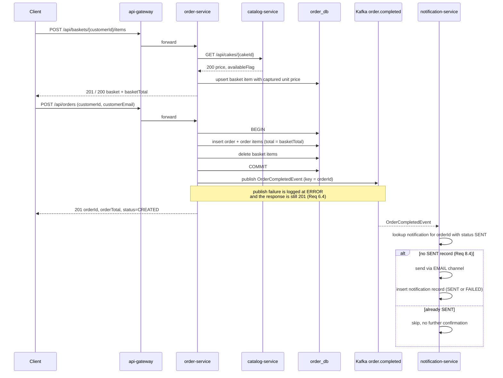

# Design Document

## Overview

Cake Delight is delivered as four independent Spring Boot services behind a Spring Cloud Gateway.
Each service owns one PostgreSQL database (Requirement 10.1) and is reachable by clients only
through the gateway (Requirement 9.1). The Order Service reads cake price and availability from the
Catalog Service synchronously over REST (Requirements 3.2, 3.5, 3.6) and, after a committed
checkout, publishes one `OrderCompletedEvent` to Kafka (Requirement 6.1). The Notification Service
consumes that event and sends a confirmation exactly once per order (Requirements 8.1, 8.6).

Design choices are deliberately minimal and match the scope discipline in the steering docs: no
outbox, no dead-letter topic, no retry layer, no circuit breakers, no tracing or metrics stack.
Everything listed in the requirements' Out of Scope section stays out.

| Component | Port | Database | Requirements covered |
|---|---|---|---|
| api-gateway | 8080 | — | 9.1–9.4, 11.x, 12.4 |
| catalog-service | 8081 | `catalog_db` | 1.x, 2.x, 10.x, 11.x, 12.x |
| order-service | 8082 | `order_db` | 3.x, 4.x, 5.x, 6.x, 10.x, 11.x, 12.x |
| rating-service | 8083 | `rating_db` | 7.x, 10.x, 11.x, 12.x |
| notification-service | 8084 | `notification_db` | 8.x, 10.x, 11.x, 12.x |

Open choices resolved, one line each:

- Identifiers are UUIDs generated by the owning service.
- Money is `BigDecimal(12,2)`, `RoundingMode.HALF_UP`.
- A basket holds one row per cake identifier per customer; adding an existing cake increments quantity.
- `Order_Status` transitions are only `CREATED -> CONFIRMED`, driven by an explicit endpoint.
- The notification delivery channel is a logging `EmailChannel` stub with channel value `EMAIL`; no SMTP server is required for the capstone demo.
- Request-scoped logging uses a servlet filter that puts a generated request id into the MDC.

## Architecture

```mermaid
graph TB
    Client[Client / Swagger UI]

    subgraph Edge
        GW[api-gateway<br/>Spring Cloud Gateway<br/>:8080]
    end

    subgraph Services
        CAT[catalog-service<br/>:8081]
        ORD[order-service<br/>:8082]
        RAT[rating-service<br/>:8083]
        NOT[notification-service<br/>:8084]
    end

    CATDB[(catalog_db)]
    ORDDB[(order_db)]
    RATDB[(rating_db)]
    NOTDB[(notification_db)]

    K[[Kafka topic<br/>order.completed]]

    Client -->|/api/**| GW
    GW -->|/api/cakes/**| CAT
    GW -->|/api/baskets/**, /api/orders/**| ORD
    GW -->|/api/cakes/{cakeId}/ratings/**| RAT
    GW -->|/api/notifications/**| NOT

    CAT --> CATDB
    ORD --> ORDDB
    RAT --> RATDB
    NOT --> NOTDB

    ORD -->|GET /api/cakes/{cakeId}<br/>price + availability| CAT
    ORD -->|publish key = orderId| K
    K -->|group: notification-service| NOT
```

Route ownership note: both the Catalog Service and the Rating Service serve paths under
`/api/cakes`. The gateway route for `/api/cakes/*/ratings/**` is declared before the broader
`/api/cakes/**` route so the more specific path wins (Requirement 9.2).

### Checkout to notification flow



## Components and Interfaces

All services follow the package layout `com.cakedelight.<service>` with
`controller / service / repository / domain / dto / client / messaging / config`. Controllers hold
no business logic and never expose JPA entities. Every service exposes
`/actuator/health` with liveness and readiness groups (Requirement 12.4) and
`/swagger-ui.html` via springdoc-openapi.

### API Gateway (`api-gateway`, 8080)

Responsibility: single client entry point and route table only. No business logic, no database.

| Route order | Predicate | Target | Requirement |
|---|---|---|---|
| 1 | `/api/cakes/*/ratings/**` | `rating-service:8083` | 9.2 |
| 2 | `/api/cakes/**` | `catalog-service:8081` | 9.2 |
| 3 | `/api/baskets/**`, `/api/orders/**` | `order-service:8082` | 9.2 |
| 4 | `/api/notifications/**` | `notification-service:8084` | 9.2 |

Paths are forwarded unchanged (no strip-prefix filter). Unmatched paths return 404 with the shared
error shape and code `ROUTE_NOT_FOUND` (Requirement 9.3). A connection failure or timeout to a
downstream service returns 503 with code `SERVICE_UNAVAILABLE` and a message naming the target
service, produced by a gateway `ErrorWebExceptionHandler` mapping
`ConnectException` / `TimeoutException` (Requirement 9.4).

### Catalog Service (`catalog-service`, 8081)

Responsibility: owns cakes; lists, filters, and retrieves them.

| Method | Path | Request | Response | Statuses | Requirements |
|---|---|---|---|---|---|
| GET | `/api/cakes` | query: `name`, `category`, `minPrice`, `maxPrice`, `page` (default 0), `size` (default 20) | `PageResponse<CakeResponse>` = `{ content[], page, size, totalElements }` | 200, 400 | 1.1, 1.2, 1.3, 1.4, 2.1–2.6 |
| GET | `/api/cakes/{cakeId}` | path: UUID | `CakeResponse` | 200, 404 | 1.5, 1.6 |

`CakeResponse`: `{ id, name, description, category, price, available, imageUrl }` (Requirement 1.1).

Filtering is implemented in `CakeRepository` as a single JPA `@Query` with null-tolerant predicates,
so any combination of filters is ANDed (Requirement 2.4): name uses
`lower(name) like lower(concat('%', :name, '%'))` (2.1), category uses `lower(category) = lower(:category)`
(2.2), price uses `(:minPrice is null or price >= :minPrice)` and the symmetric upper bound (2.3).
`CakeQueryValidator` in the service layer rejects `minPrice > maxPrice` with 400 naming both
parameters (2.5); negative values are rejected by `@PositiveOrZero` on the request params and
non-numeric values surface as `MethodArgumentTypeMismatchException` mapped to 400 naming the
parameter (2.6).

### Order Service (`order-service`, 8082)

Responsibility: owns baskets and orders; captures unit price from the Catalog Service, computes
totals, performs checkout, publishes the order completion event.

| Method | Path | Request | Response | Statuses | Requirements |
|---|---|---|---|---|---|
| POST | `/api/baskets/{customerId}/items` | `{ cakeId, quantity }` | `BasketResponse` | 201 new item, 200 existing item, 400, 404, 409 | 3.1–3.6 |
| GET | `/api/baskets/{customerId}` | — | `BasketResponse` | 200 | 4.1, 4.2 |
| PUT | `/api/baskets/{customerId}/items/{cakeId}` | `{ quantity }` | `BasketResponse` | 200, 400, 404 | 4.3, 4.5 |
| DELETE | `/api/baskets/{customerId}/items/{cakeId}` | — | `BasketResponse` | 200, 404 | 4.4, 4.5 |
| POST | `/api/orders` | `{ customerId, customerEmail }` | `CheckoutResponse` = `{ orderId, orderTotal, status }` | 201, 400 | 5.1, 5.2, 5.4, 5.5 |
| GET | `/api/orders/{orderId}` | — | `OrderResponse` | 200, 404 | 5.6, 5.7 |
| POST | `/api/orders/{orderId}/confirmation` | — | `{ orderId, status }` | 200, 404 | 6.5 |

`BasketResponse`: `{ customerId, items: [{ cakeId, cakeName, unitPrice, quantity, lineTotal }], basketTotal }`
(Requirement 4.1). An absent basket returns an empty item list and `basketTotal` `0.00` (4.2).

`OrderResponse`: `{ orderId, customerId, status, orderTotal, createdAt, items: [{ cakeId, cakeName, unitPrice, quantity, lineTotal }] }`
(Requirement 5.6).

`BasketService` computes `lineTotal = unitPrice * quantity` scaled to 2 HALF_UP and
`basketTotal = sum(lineTotal)`, so the invariant in Requirement 4.6 holds by construction from a
single calculation path.

`CheckoutService.checkout` is `@Transactional`: it validates the basket is non-empty (5.4) and the
email is present and well-formed via `@Email` (5.5), inserts the order and its items with
`total = basketTotal` and `status = CREATED` (5.1), and deletes the basket items in the same
transaction (5.3). The Kafka publish happens after the transaction commits, in the controller-facing
service method after `checkout` returns, so no event is published when the transaction rolls back
(6.3).

#### Catalog client (synchronous read)

`CatalogClient` (package `client`) wraps a `RestClient` bean with connect and read timeouts (5 s
each) pointed at `CATALOG_SERVICE_URL`. `getCake(UUID cakeId)` calls
`GET /api/cakes/{cakeId}` and returns `CakeSnapshot { id, name, price, available }`. Mapping:

- 200 and `available == true`: the price becomes the stored unit price (Requirement 3.2) and the name is echoed in `BasketResponse` (4.1).
- 200 and `available == false`: throw `CakeUnavailableException` -> 409 (Requirement 3.6).
- 404: throw `CakeNotFoundException` -> 404 containing the cake identifier (Requirement 3.5).
- Connection failure or timeout: throw `CatalogUnavailableException` -> 503 (Requirement 12.2 shape).

The basket is never modified before the client call succeeds, which satisfies the "leave the Basket
unchanged" clauses in 3.4, 3.5, and 3.6.

#### Order completed publisher

`OrderCompletedPublisher` (package `messaging`) sends the event with `KafkaTemplate<String, OrderCompletedEvent>`
using the order identifier as the key. On any send exception or failed send callback it logs
`ERROR "Failed to publish order.completed for orderId={}"` and returns normally, so the checkout
response is still 201 (Requirement 6.4). Nothing is retried and nothing is stored for later replay.

### Rating Service (`rating-service`, 8083)

Responsibility: owns ratings; stores submissions and computes the average per cake.

| Method | Path | Request | Response | Statuses | Requirements |
|---|---|---|---|---|---|
| POST | `/api/cakes/{cakeId}/ratings` | `{ customerId, score }` | `RatingResponse` = `{ id, cakeId, customerId, score, createdAt }` | 201, 400 | 7.1, 7.2, 7.3 |
| GET | `/api/cakes/{cakeId}/ratings` | — | `RatingResponse[]` | 200 | 7.4 |
| GET | `/api/cakes/{cakeId}/ratings/average` | — | `AverageRatingResponse` = `{ cakeId, averageRating, ratingCount }` | 200 | 7.5, 7.6 |

`score` is validated with `@Min(1) @Max(5)` and `customerId` with `@NotNull` (7.2, 7.3); a missing
or non-integer `cakeId` path value is a 400 from type mismatch (7.3).
`RatingService.average(cakeId)` uses a repository aggregate (`avg(score)`, `count(*)`) and rounds to
one decimal HALF_UP (7.5). With no stored ratings it returns `averageRating = null` and
`ratingCount = 0` (7.6). Because every stored score is constrained to 1..5 at write time and the
average of values in `[1,5]` stays in `[1,5]`, the invariant in Requirement 7.7 holds.

The Order Service does not call the Rating Service. Average ratings are read by the client directly
through the gateway alongside the cake detail view, which keeps the cross-service call count at one
(Requirement 10.2).

### Notification Service (`notification-service`, 8084)

Responsibility: owns notification records; consumes `order.completed` and sends one confirmation
per order.

| Method | Path | Request | Response | Statuses | Requirements |
|---|---|---|---|---|---|
| GET | `/api/notifications/orders/{orderId}` | — | `NotificationResponse[]` = `[{ id, orderId, channel, status, attemptedAt }]` | 200 | 8.5 |

`OrderCompletedListener` (package `messaging`) is a `@KafkaListener(topics = "order.completed", groupId = "notification-service")`.
Handling sequence:

1. `notificationRepository.existsByOrderIdAndStatus(orderId, SENT)` — if true, log at INFO and return without sending (Requirement 8.4).
2. Build the confirmation body from the event's order identifier, ordered items, and order total; send through `EmailChannel` to the event's contact details (Requirement 8.1).
3. Insert a notification record with `orderId`, `channel`, `status`, `attemptedAt` (Requirement 8.2).
4. If the channel throws, insert the record with `status = FAILED` and log `ERROR` with the order identifier and failure reason (Requirement 8.3).

If two events for the same order are processed concurrently, the unique index on
`(order_id)` where status is `SENT` rejects the second insert; the resulting
`DataIntegrityViolationException` is caught and logged, so at most one successful confirmation
exists per order (Requirement 8.6). This unique constraint plus the pre-send lookup is the whole
idempotency mechanism.

## Data Models

Every service uses Spring Data JPA with Flyway. Each database has exactly one owning service, and
the datasource URL comes from an environment variable, so a service configured against another
service's database fails at startup on the Flyway schema-history check (Requirement 10.3).

### catalog_db — `cakes`

`Cake` entity: `id UUID`, `name String`, `description String`, `category String`,
`price BigDecimal(12,2)`, `available boolean`, `imageUrl String`.

```sql
-- V1__create_cakes.sql
CREATE TABLE cakes (
    id           UUID PRIMARY KEY,
    name         VARCHAR(150)   NOT NULL,
    description  VARCHAR(1000),
    category     VARCHAR(50)    NOT NULL,
    price        NUMERIC(12,2)  NOT NULL CHECK (price >= 0),
    available    BOOLEAN        NOT NULL DEFAULT TRUE,
    image_url    VARCHAR(500)
);

CREATE INDEX idx_cakes_category_lower ON cakes (lower(category));
CREATE INDEX idx_cakes_name_lower     ON cakes (lower(name));
CREATE INDEX idx_cakes_price          ON cakes (price);
```

`V2__seed_cakes.sql` inserts a small demo catalog so the browse and filter flow is demonstrable.
The three indexes back the category, name, and price-range filters in Requirement 2.

### order_db — `basket_items`, `orders`, `order_items`

`BasketItem`: `id UUID`, `customerId String`, `cakeId UUID`, `cakeName String`,
`unitPrice BigDecimal(12,2)`, `quantity int`.
`Order`: `id UUID`, `customerId String`, `customerEmail String`, `total BigDecimal(12,2)`,
`status OrderStatus` (enum `CREATED`, `CONFIRMED`), `createdAt Instant`, `items List<OrderItem>`.
`OrderItem`: `id UUID`, `order Order`, `cakeId UUID`, `cakeName String`,
`unitPrice BigDecimal(12,2)`, `quantity int`.

```sql
-- V1__create_baskets_and_orders.sql
CREATE TABLE basket_items (
    id          UUID PRIMARY KEY,
    customer_id VARCHAR(100)  NOT NULL,
    cake_id     UUID          NOT NULL,
    cake_name   VARCHAR(150)  NOT NULL,
    unit_price  NUMERIC(12,2) NOT NULL CHECK (unit_price >= 0),
    quantity    INTEGER       NOT NULL CHECK (quantity > 0),
    CONSTRAINT uq_basket_customer_cake UNIQUE (customer_id, cake_id)
);

CREATE INDEX idx_basket_items_customer ON basket_items (customer_id);

CREATE TABLE orders (
    id             UUID PRIMARY KEY,
    customer_id    VARCHAR(100)  NOT NULL,
    customer_email VARCHAR(255)  NOT NULL,
    total          NUMERIC(12,2) NOT NULL CHECK (total >= 0),
    status         VARCHAR(20)   NOT NULL,
    created_at     TIMESTAMPTZ   NOT NULL
);

CREATE INDEX idx_orders_customer ON orders (customer_id);

CREATE TABLE order_items (
    id         UUID PRIMARY KEY,
    order_id   UUID          NOT NULL REFERENCES orders (id) ON DELETE CASCADE,
    cake_id    UUID          NOT NULL,
    cake_name  VARCHAR(150)  NOT NULL,
    unit_price NUMERIC(12,2) NOT NULL CHECK (unit_price >= 0),
    quantity   INTEGER       NOT NULL CHECK (quantity > 0)
);

CREATE INDEX idx_order_items_order ON order_items (order_id);
```

`uq_basket_customer_cake` is what makes "add an existing cake" a quantity increment rather than a
duplicate row (Requirement 3.3). `idx_basket_items_customer` backs the basket view and the
checkout clear (4.1, 5.3).

### rating_db — `ratings`

`Rating`: `id UUID`, `cakeId UUID`, `customerId String`, `score int`, `createdAt Instant`.

```sql
-- V1__create_ratings.sql
CREATE TABLE ratings (
    id          UUID PRIMARY KEY,
    cake_id     UUID         NOT NULL,
    customer_id VARCHAR(100) NOT NULL,
    score       INTEGER      NOT NULL CHECK (score BETWEEN 1 AND 5),
    created_at  TIMESTAMPTZ  NOT NULL
);

CREATE INDEX idx_ratings_cake ON ratings (cake_id);
```

The `CHECK (score BETWEEN 1 AND 5)` is the database-level guarantee behind the average-range
invariant (Requirement 7.7). `idx_ratings_cake` backs both the rating list and the average
aggregate (7.4, 7.5). Multiple ratings per customer per cake are allowed; no uniqueness is required
by Requirement 7.

### notification_db — `notifications`

`Notification`: `id UUID`, `orderId UUID`, `channel String` (`EMAIL`),
`status NotificationStatus` (enum `SENT`, `FAILED`), `attemptedAt Instant`.

```sql
-- V1__create_notifications.sql
CREATE TABLE notifications (
    id           UUID PRIMARY KEY,
    order_id     UUID         NOT NULL,
    channel      VARCHAR(20)  NOT NULL,
    status       VARCHAR(20)  NOT NULL,
    attempted_at TIMESTAMPTZ  NOT NULL
);

CREATE UNIQUE INDEX uq_notifications_order_sent
    ON notifications (order_id) WHERE status = 'SENT';

CREATE INDEX idx_notifications_order ON notifications (order_id);
```

The partial unique index allows any number of FAILED attempts but at most one SENT record per order
(Requirements 8.4, 8.6). `idx_notifications_order` backs the lookup endpoint (8.5).

### Shared error response

Same shape in every service and in the gateway (Requirement 12.2):

```json
{
  "code": "CAKE_NOT_FOUND",
  "message": "Cake 7f1c... was not found",
  "timestamp": "2025-05-04T10:15:30Z",
  "path": "/api/cakes/7f1c..."
}
```

Java: `record ErrorResponse(String code, String message, Instant timestamp, String path)`. Each
service keeps its own copy; there is no shared library.

## Event Contract

Topic `order.completed`, 1 partition, replication factor 1. Key: the order identifier as a string,
so all events for one order land on one partition. Consumer group: `notification-service`. JSON via
Spring Kafka `JsonSerializer` / `JsonDeserializer`. Publisher and consumer each keep their own copy
of the record; the canonical contract lives in `docs/event-contract.md`.

| Field | Type | Notes | Requirement |
|---|---|---|---|
| `orderId` | string (UUID) | also the message key | 6.2 |
| `customerId` | string | | 6.2 |
| `customerEmail` | string | the contact details used for delivery | 6.2, 8.1 |
| `orderTotal` | number (2 dp) | equals the order total | 6.2 |
| `createdAt` | string (ISO-8601 instant) | order creation timestamp | 6.2 |
| `items` | array | ordered items | 6.2, 8.1 |
| `items[].cakeId` | string (UUID) | | 6.2 |
| `items[].cakeName` | string | | 8.1 |
| `items[].unitPrice` | number (2 dp) | | 6.2 |
| `items[].quantity` | integer | | 6.2 |

```json
{
  "orderId": "6b1a2c3d-0000-4000-8000-000000000001",
  "customerId": "cust-1001",
  "customerEmail": "customer@example.com",
  "orderTotal": 47.50,
  "createdAt": "2025-05-04T10:15:30Z",
  "items": [
    { "cakeId": "1f2e3d4c-0000-4000-8000-000000000002", "cakeName": "Chocolate Truffle", "unitPrice": 23.75, "quantity": 2 }
  ]
}
```

## Correctness Properties

*A property is a characteristic or behavior that should hold true across all valid executions of a
system — essentially, a formal statement about what the system should do. Properties serve as the
bridge between human-readable specifications and machine-verifiable correctness guarantees.*

Three of these come straight from the FOR ALL clauses in the requirements. Two are round trips that
are cheap to state and catch real bugs. Everything else in the requirements is covered by the unit,
example, and edge-case tests listed in the Testing Strategy.

### Property 1: Basket total equals the sum of line totals

*For any* customer identifier and *for any* finite sequence of basket operations (add with a
positive quantity, update to a positive quantity, remove) applied over randomly generated cake
identifiers, unit prices, and quantities, the reported `basketTotal` after every operation equals the
sum of `unitPrice * quantity` over the stored basket items, each line rounded to two decimal places
HALF_UP.

Generators: `customerId` non-blank string; `cakeId` UUID drawn from a small pool so repeats occur;
`unitPrice` `BigDecimal` in `[0.00, 999.99]` scale 2; `quantity` integer in `[1, 20]`; operation
sequence length in `[1, 25]`. Sequences that repeat a cake identifier exercise the add-increments and
update-replaces behaviour, and remove-then-check exercises recalculation.

**Validates: Requirements 4.6, 3.3, 4.3, 4.4**

### Property 2: Checkout mirrors the basket and the order reads back unchanged

*For any* non-empty randomly generated basket, checkout produces exactly one order whose item
multiset equals the basket's items (cake identifier, unit price, quantity), whose `orderTotal` equals
the pre-checkout `basketTotal`, and whose status is `CREATED`; the basket is empty afterwards; and
fetching the order by its identifier returns the same items, total, and status.

Generators: basket of 1..10 items built with the Property 1 generators.

**Validates: Requirements 5.1, 5.3, 5.6**

### Property 3: Average rating stays within 1.0 and 5.0

*For any* cake identifier and *for any* non-empty list of rating scores drawn from the integers 1
through 5, the reported `averageRating` is between 1.0 and 5.0 inclusive, equals the arithmetic mean
of the stored scores rounded to one decimal place HALF_UP, and the reported `ratingCount` equals the
number of stored ratings.

Generators: `cakeId` UUID; `scores` list of length `[1, 50]` with each element in `[1, 5]`;
`customerId` non-blank string per rating.

**Validates: Requirements 7.7, 7.5**

### Property 4: At most one successful notification per order

*For any* randomly generated `OrderCompletedEvent` and *for any* delivery multiplicity n ≥ 1,
delivering that same event n times to the listener results in exactly one notification record with
status `SENT` for that order identifier and exactly one invocation of the delivery channel.

Generators: `orderId` UUID; `customerEmail` valid email string; 1..10 items with the Property 1
generators; `n` integer in `[1, 5]`.

**Validates: Requirements 8.6, 8.4**

### Property 5: Order completed event survives a JSON round trip

*For any* randomly generated `OrderCompletedEvent`, serializing it with the configured Spring Kafka
`JsonSerializer` and deserializing it with the matching `JsonDeserializer` yields an equal event,
with `orderId`, `customerId`, `customerEmail`, `orderTotal`, `createdAt`, and every item field
preserved including monetary scale.

Generators: as Property 4.

**Validates: Requirements 6.2**

## Error Handling

Every service and the gateway return the same body (Requirement 12.2):

```json
{ "code": "...", "message": "...", "timestamp": "...", "path": "..." }
```

Each service has one `GlobalExceptionHandler` annotated `@RestControllerAdvice` in `config/`:

| Exception | Status | Code | Requirements |
|---|---|---|---|
| `MethodArgumentNotValidException`, `ConstraintViolationException`, `MethodArgumentTypeMismatchException`, `MissingServletRequestParameterException` | 400 | `VALIDATION_ERROR` | 2.5, 2.6, 3.4, 5.5, 7.2, 7.3, 12.1 |
| `InvalidPriceRangeException` | 400 | `INVALID_PRICE_RANGE` | 2.5 |
| `EmptyBasketException` | 400 | `BASKET_EMPTY` | 5.4 |
| `CakeNotFoundException` | 404 | `CAKE_NOT_FOUND` | 1.6, 3.5 |
| `BasketItemNotFoundException` | 404 | `BASKET_ITEM_NOT_FOUND` | 4.5 |
| `OrderNotFoundException` | 404 | `ORDER_NOT_FOUND` | 5.7 |
| `CakeUnavailableException` | 409 | `CAKE_UNAVAILABLE` | 3.6 |
| `CatalogUnavailableException` | 503 | `CATALOG_UNAVAILABLE` | 3.x dependency failure |
| `Exception` (fallback) | 500 | `INTERNAL_ERROR` | 12.3 |

The 400 handler builds the message from the field errors so the offending field name always appears
(Requirement 12.1). The fallback handler logs the stack trace at ERROR before responding
(Requirement 12.3).

Gateway: a `GlobalErrorHandler` implementing `ErrorWebExceptionHandler` returns 404
`ROUTE_NOT_FOUND` for an unmatched path (Requirement 9.3) and 503 `SERVICE_UNAVAILABLE` naming the
target service for `ConnectException` or a read timeout (Requirement 9.4).

Dependency failures, spelled out:

- **Catalog Service unreachable during an add-to-basket call.** The `RestClient` connect or read
  timeout fires, `CatalogClient` throws `CatalogUnavailableException`, the advice returns 503, and the
  basket is untouched because nothing is written before the client call returns. No retry, no
  fallback price.
- **Kafka unreachable at checkout.** The order is already committed. `OrderCompletedPublisher`
  catches the send failure, logs
  `ERROR "Failed to publish order.completed for orderId={} : {}"`, and the checkout still returns 201
  (Requirement 6.4). The event is not stored for replay and is not retried; recovering it is out of
  scope for this increment.
- **Kafka unreachable at Notification Service startup.** The `@KafkaListener` container retries the
  connection on its own schedule and the service stays up; `/actuator/health/readiness` reflects the
  broker state through the default Kafka health indicator.

Structured request logging (Requirement 12.5): a `RequestLoggingFilter` per service generates or
reuses an `X-Request-Id`, puts it in the MDC, and logs one entry per request with request id, HTTP
method, path, response status, and elapsed milliseconds.

## Testing Strategy

Unit tests cover business logic with mocks. `@WebMvcTest` slices cover controllers, validation, and
the exception advice. Testcontainers cover repositories, Flyway migrations, and the Kafka path.
Property-based tests cover the five properties above using **jqwik 1.8.x** (JUnit 5 platform), each
configured with `@Property(tries = 100)` at minimum and tagged with a comment in the form
`// Feature: cake-delight-microservices, Property N: <property text>`. One property-based test per
property, no more.

### catalog-service

| Test class | Type | Covers |
|---|---|---|
| `CakeServiceTest` | unit, Mockito | list defaults page 0 size 20, filter delegation, not-found path (1.2, 1.6) |
| `CakeQueryValidatorTest` | unit | `minPrice > maxPrice` and negative price rejection (2.5, 2.6) |
| `CakeControllerTest` | `@WebMvcTest` | response shape and metadata, 200/400/404 statuses (1.1, 1.3, 1.5, 1.6, 12.2) |
| `CakeRepositoryIT` | Testcontainers PostgreSQL | case-insensitive name and category filters, inclusive price bounds, combined filters, empty result (1.4, 2.1–2.4) |

### order-service

| Test class | Type | Covers |
|---|---|---|
| `BasketServiceTest` | unit, Mockito `CatalogClient` | add/increment/update/remove, unit price capture, 404 and 409 mapping, unchanged-basket assertions (3.1–3.6, 4.1–4.5) |
| `CheckoutServiceTest` | unit | empty basket rejection, no event on failure (5.4, 6.3) |
| `BasketControllerTest`, `OrderControllerTest` | `@WebMvcTest` | statuses 200/201/400/404/409, quantity and email validation, error shape (3.4, 5.2, 5.5, 5.7, 6.5, 12.2, 12.3) |
| `OrderCompletedPublisherTest` | unit, throwing `KafkaTemplate` | ERROR log with orderId and 201 still returned (6.4) |
| `CheckoutTransactionIT` | Testcontainers PostgreSQL | order persisted and basket cleared atomically; rollback leaves both untouched (5.3) |
| `OrderCompletedPublisherIT` | Testcontainers Kafka | exactly one record on `order.completed` keyed by orderId (6.1) |
| `CrossDatabaseConfigIT` | Testcontainers PostgreSQL | startup fails when pointed at another service's database (10.3) |
| `BasketTotalPropertyTest` | jqwik | **Property 1** |
| `CheckoutMirrorsBasketPropertyTest` | jqwik | **Property 2** |
| `OrderCompletedEventJsonPropertyTest` | jqwik | **Property 5** |

### rating-service

| Test class | Type | Covers |
|---|---|---|
| `RatingServiceTest` | unit | store, list, null average with count 0 (7.1, 7.4, 7.6) |
| `RatingControllerTest` | `@WebMvcTest` | score 0/6/-1 and missing field rejection, 201 and 200 shapes (7.1–7.3, 12.2) |
| `RatingRepositoryIT` | Testcontainers PostgreSQL | `findByCakeId`, aggregate average and count, CHECK constraint (7.4, 7.5) |
| `AverageRatingPropertyTest` | jqwik | **Property 3** |

### notification-service

| Test class | Type | Covers |
|---|---|---|
| `OrderCompletedListenerTest` | unit, fake channel | message content, record fields, FAILED on channel rejection (8.1–8.3) |
| `NotificationControllerTest` | `@WebMvcTest` | 200 and record list shape (8.5, 12.2) |
| `NotificationListenerIT` | Testcontainers Kafka + PostgreSQL | event consumed end to end, record persisted (8.1, 8.2) |
| `NotificationIdempotencyPropertyTest` | jqwik | **Property 4** |

### api-gateway

| Test class | Type | Covers |
|---|---|---|
| `GatewayRoutingIT` | `@SpringBootTest` + WireMock | each route reaches the right downstream, ratings route wins over the cakes route (9.2) |
| `GatewayErrorHandlingIT` | `@SpringBootTest` | 404 unknown route, 503 for a closed downstream port (9.3, 9.4) |

### All components

`HealthEndpointIT` per component asserts `/actuator/health/liveness` and
`/actuator/health/readiness` return 200 (Requirement 12.4). `RequestLoggingFilterTest` per service
asserts the five logged fields (Requirement 12.5).

## Deployment

### Dockerfile (one per component, multi-stage)

```dockerfile
FROM maven:3.9.9-eclipse-temurin-21 AS build
WORKDIR /build
COPY pom.xml .
RUN mvn -B dependency:go-offline
COPY src ./src
RUN mvn -B clean package -DskipTests

FROM eclipse-temurin:21.0.4_7-jre-alpine
WORKDIR /app
COPY --from=build /build/target/*.jar app.jar
EXPOSE 8081
ENTRYPOINT ["java", "-jar", "/app/app.jar"]
```

Base image tags are pinned, never `latest` (Requirement 11.1). Only the `EXPOSE` port differs per
component.

### docker-compose.yml services (Requirement 11.2)

| Service | Image / build | Notes |
|---|---|---|
| `kafka` | `apache/kafka:3.7.1` | KRaft single node, auto-create topics enabled so `order.completed` appears with 1 partition |
| `catalog-db` | `postgres:16.4` | `POSTGRES_DB=catalog_db` |
| `order-db` | `postgres:16.4` | `POSTGRES_DB=order_db` |
| `rating-db` | `postgres:16.4` | `POSTGRES_DB=rating_db` |
| `notification-db` | `postgres:16.4` | `POSTGRES_DB=notification_db` |
| `catalog-service` | `build: ./catalog-service` | `8081`, depends on `catalog-db` |
| `order-service` | `build: ./order-service` | `8082`, depends on `order-db`, `kafka`, `catalog-service` |
| `rating-service` | `build: ./rating-service` | `8083`, depends on `rating-db` |
| `notification-service` | `build: ./notification-service` | `8084`, depends on `notification-db`, `kafka` |
| `api-gateway` | `build: ./api-gateway` | the only published port, `8080:8080` (Requirement 9.1) |

Service containers use `depends_on` with `condition: service_healthy` against the Postgres and Kafka
health checks; application containers declare a health check hitting `/actuator/health/readiness`.

### Kubernetes manifests (Requirements 11.3, 11.5)

`k8s/namespace.yaml` creates the `cake-delight` namespace. Per component under
`k8s/<component>/`:

- `deployment.yaml` — 1 replica, container port, `envFrom` a ConfigMap and a Secret, liveness probe on `/actuator/health/liveness`, readiness probe on `/actuator/health/readiness`.
- `service.yaml` — `ClusterIP` for the four services, matching the directory name. The gateway gets a `NodePort` Service, the only externally reachable one (Requirement 9.1).
- `configmap.yaml` — non-secret config: `SPRING_DATASOURCE_URL`, `SPRING_KAFKA_BOOTSTRAP_SERVERS`, `CATALOG_SERVICE_URL`, downstream URIs for the gateway.
- `secret.yaml` — `SPRING_DATASOURCE_USERNAME`, `SPRING_DATASOURCE_PASSWORD`, committed as a template with placeholder values only.

`k8s/postgres/` holds four `StatefulSet`-free Deployments plus a `Service` and a `PersistentVolumeClaim`
each, one per database. `k8s/kafka/` holds a single-node Kafka Deployment and Service.

Configuration injection: no value is baked into an image or committed with a real credential. Every
service reads `SPRING_DATASOURCE_*`, `SPRING_KAFKA_BOOTSTRAP_SERVERS`, and (order-service only)
`CATALOG_SERVICE_URL` from the environment, supplied by Compose `environment:` blocks locally and by
`envFrom` ConfigMap/Secret references in Kubernetes (Requirement 11.5).

Replica scaling (Requirement 11.4): the services hold no in-memory session or cache state. Baskets
live in `order_db`, so any replica can serve any customer, and increasing `replicas` needs no image
change. Kafka consumer group `notification-service` with a single partition means one
Notification Service replica consumes at a time; extra replicas stay idle standbys, which is
acceptable for this increment.
